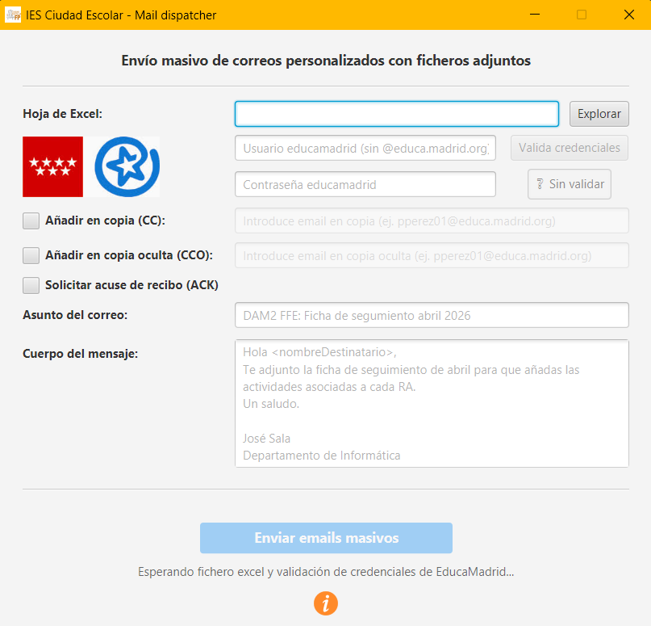

# 📝 Mail Dispatcher - Churrera de emails

👨‍🏫 IES: Ciudad Escolar

📥 Depto: Informática y Comunicaciones

🧑‍💻 Profesor: José Sala Gutiérrez

---

## Descripción del proyecto

El objetivo de este proyecto no es otro que facilitar el trabajo burocrático de los docentes de los ciclos formativos de FP en centros de la Comunidad de Madrid, en concreto, en el IES Ciudad Escolar.

En este proyecto se automatiza el envío masivo de correos electrónicos masivos y personalizados a través del servidor institucional de EducaMadrid.

La aplicación está pensada para facilitar la labor docente, permitiendo enviar notificaciones, informes individuales (como fichas de seguimiento o planes de formación de la FFE) donde a cada destinatario le corresponde un fichero adjunto distinto del resto.  

La lista de destinatarios y el fichero que corresponde a cada uno se obtiene de un fichero excel.


## Interfaz gráfica

La aplicación cuenta con una interfaz gráfica intuitiva y sencilla:



## Releases

Para facilitar la distribución de la herramienta se ha generado una release con todo lo necesario para poder ejecutarlo. La puedes encontrar en la sección  `releases` dentro de este repositorio de GitHub como un fichero ZIP.

```text
MailDispatcher_v1.0.0.zip (última versión)
```

## Manual de instrucciones

Para poder utilizar esta herramienta, sigue los siguientes pasos:

1) Descarga la release publicada

2) Descomprime el fichero en tu directorio personal de trabajo (ej. C:\Users\xxx)

3) Modifica el fichero `datos_maildispatcher.xlsx` incluido en el directorio comprimido añadiendo los registros con los datos de cada destinatario al que se quiera enviar un email. Asegúrate de indicar su nombre de pila para el saludo y la ruta completa del fichero a enviarle. 

4) Haz doble clic en el ejecutable `MailDispatcher.exe` y se abrirá la ventana de la aplicación. Si Windows lo identifica como software no seguro, solo es debido a no haber abonado los 200€ anuales que exigen para evitar esa ventanita azul tan molesta. Te aseguro que no tiene ningún tipo de malware.

5) Arrancada la aplicación, lo primero es siempre Seleccionar el fichero excel modificado en el paso 3. Para ello haz clic en explorar y localízalo en tu PC.

6) A continuación debes validar tus credenciales de Educa Madrid añadiendo tu usuario (sin @educa.madrid.org) y contraseña. Finalmente debes hacer click en el botón `valida credenciales`.

7) Fija el asunto del correo (la aplicación añadirá el nombre del destinatario. ej: - Paco )

8) Fija el cuerpo del mensaje. Asegúrate de que usas `<nombreDestinatario>` en el saludo y la aplicación tomará el nombre de pila del destinatario del fichero excel.

9) Si quieres puedes activar alguna de las siguientes opciones:
   1) CC: Añadir en copia
   2) CCO: Añadir en copia oculta
   3) ACK: Solicitar acuse de recibo a los destinatarios

10) Si la excel está seleccionada y las credenciales usadas validadas, el botón general `enviar emails masivos` se habilitará y podrá ser clicado para comenzar el envío masivo.

11) Tras la ejecución, podrás ver todos los envíos en tu carpeta de correos enviados.

## Tecnologías utilizadas

- Maven + Java 21 (LTS)
- slf4j + Logback
- Jakarta Mail
- jpackage + signtool
- apache poi
- JavaFX

## Bug fixing

- N/A

## Versiones

- v1.0.0: Obliga a enviar un único fichero adjunto para cada destinatario.
